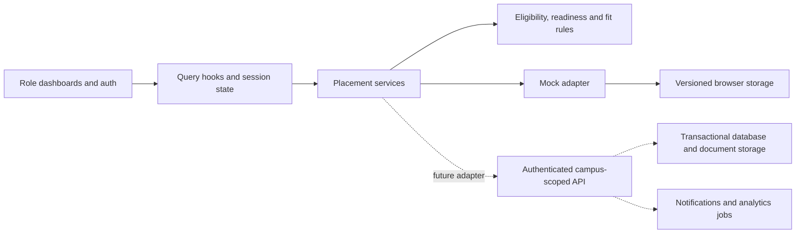

# CampusLink prototype deliverables

This document records the earlier frontend-only milestone. The current Express implementation, external-service setup and model limits are documented in [BACKEND-SETUP.md](BACKEND-SETUP.md) and [server/API.md](server/API.md).

Reviewed against Problem_Statement_10.pdf. This implementation follows the existing frontend-first brief: simulated placement records, interactive workflows, explainable rules, and replaceable service adapters. It does not claim trained AI accuracy or production authentication.

## Requirements and demonstration

| PDF deliverable | Current demonstration |
| --- | --- |
| Working prototype | Three role dashboards, role-aware registration, persistent sidebar navigation, responsive views |
| Readiness and skill gaps | Student → Placement readiness; score recomputed from recorded evidence; choose a target active drive to see missing or unverified skills |
| At least three simulated drives | Seeded approved campus drives; eligibility filtering and ranked fit scores |
| Conflict-aware scheduling | Recruiter campus request → campus review → resource/date proposal → recruiter confirmation → campus finalization → activation; overlapping venue, infrastructure, recruiter, or cohort bookings are rejected |
| Explainable matching | Candidate details show eligibility checks and weighted skill, academic, project, certification, and assessment factors |
| Placement monitoring | Campus/recruiter → Analytics; current drive pipeline, offers, documents, joining, branch and skill conversion, package summaries, preparation support flag |
| Offer and document tracking | Full-time/PPO/internship conversion labels; accept, decline, defer, withdraw acceptance; campus records joining; document metadata upload and verification |
| Architecture and algorithms | Described below; implemented service and utility boundaries |
| Simulated dataset | `src/mocks/data.ts` and `src/mocks/placement.ts`; Diptiprav Dash is the tracked student, Sonalika Nayak is the primary preview persona |
| Evaluation | Automated reference-score, boundary, mutation, eligibility, scheduling, and lifecycle tests |
| Scalability/deployment approach | Proposed production transition below; current preview remains a local frontend |

## Architecture

Persistent layout components avoid rebuilding the dashboard shell on sidebar navigation. Query invalidation refreshes the platform and readiness after mutations. The mock adapter persists changes before reporting success. Production services can replace the adapter without making presentation components manage API transport.

## Algorithms

Readiness is a weighted score from 0 to 100: verified skill coverage 30%, academics 20%, projects 15%, aptitude 15%, communication 10%, and interview evidence 10%. Academic score is CGPA × 10 minus 10 per active backlog, clamped to 0–100. Projects contribute 35 each, capped at 100. Assessment categories average recorded attempts. Missing evidence contributes zero.

Levels: below 45 Not Ready; 45–69 Developing; 70–84 Ready; 85+ Highly Employable. These are prototype thresholds, not validated employability classifications.

Matching first checks campus, course, branch, graduation year, CGPA, and backlog eligibility. Failed eligibility produces zero fit. Eligible pairs use required-skill alignment 45%, assessment performance 20%, project relevance 15%, certification evidence 5%, and academics 15%. Required verified skills receive full credit, unverified claimed skills half credit, and absent skills zero. Project relevance uses literal required-skill keywords in titles/descriptions. Certifications currently count recorded entries, not credential authenticity. Results are ranked by score. Preview candidate personas have no personal assessment history; they do not inherit the tracked student’s attempts.

The preparation-support flag is triggered only when readiness is below 70 and there is no accepted offer. It exposes contributing weak evidence and is not a placement probability. Analytics uses one tracked student rather than inventing outcomes for six candidate previews. Branch/skill rates display sample size, and multiple accepted offers count as one placed student. Package ranges use their lower quoted LPA figure.

## Evaluation and limits

Run `node node_modules/vitest/vitest.mjs run`. Tests cover missing evidence, monotonic progress after verification, the 100-point readiness ceiling, a manually calculated 99-point fit example, ineligible pairs, unverified/missing skill explanations, multiple offers without duplicated student counts, and scoring across at least three active drives. The scoring test also evaluates 1,000 repetitions per seeded active drive; timing includes assertion overhead and is not a production load benchmark.

Lifecycle tests verify the full campus activation sequence, role/out-of-order rejection, schedule/resource conflicts, application eligibility, attendance and round limits. Existing tests cover authentication, skill assessments, points, ID portrait persistence, and interview practice. Passing tests establish rule correctness on these fixtures; they do not establish prediction accuracy. There is no labelled outcome dataset for precision/recall, model calibration, or fairness validation.

## Demonstration sequence

1. Register/sign in as a student. Edit academic/skill evidence and view the automatic ID in profile/dashboard. Choose a target drive in readiness and inspect its gaps.
2. Use recruiter demo access. Select a campus, submit a request, and inspect ranked eligible candidates and their score explanations.
3. Use campus demo access. Review the request, propose a visit and resources, then return to recruiter confirmation. Finalize and activate as campus. Try a conflicting slot to demonstrate rejection.
4. Apply as the eligible student, advance the application, and schedule the on-campus interview. Check in-app notifications.
5. Create a demo offer as recruiter, respond as student, verify documents and record joining as campus. Open Analytics and export the current CSV to see updated outcomes.

## Production transition

Use campus-scoped identifiers and server-enforced role authorization; replace local mock storage with authenticated API services and transactional placement records. Store actual resumes/offer letters in access-controlled object storage, with verification history and retention rules. Schedule/resource reservations need transactional conflict protection. Queue targeted notification jobs with deduplication and retries; aggregate analytics by campus and reporting period while retaining sample sizes. Keep model/API secrets on the server.

Before deploying learned predictions, obtain a consented, labelled historical dataset; separate training and evaluation by academic cohort/campus, compare the rule baseline with candidate models, and report ranking quality, precision/recall, calibration, and subgroup errors. Benchmark realistic concurrent request and analytics workloads. Current gaps deliberately retained from the frontend-first brief: external email/SMS delivery, persistent multi-user authentication, real document-content storage/parsing, trained AI/vector matching, and validated predictive outcomes.
